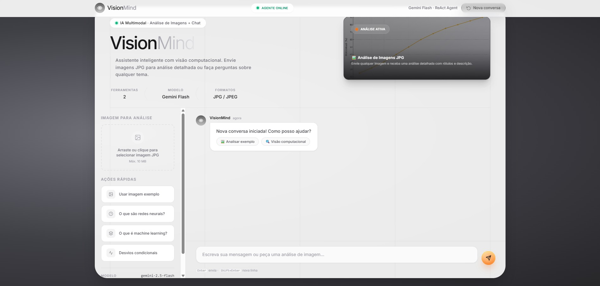

# 🧠 VisionMind

Assistente multimodal desenvolvido com **Python, LangChain e Google Gemini**, capaz de analisar imagens, responder perguntas, explicar conceitos e utilizar ferramentas inteligentes através de um agente orquestrador.

---

## 📸 Interface


---

## 🚀 Funcionalidades

- 🤖 Assistente conversacional
- 🖼️ Análise de imagens com Gemini Vision
- 🧠 Explicação de conceitos e conteúdos
- 🔧 Agente Orquestrador com LangChain
- 📤 Upload de imagens pela interface
- 🌐 Aplicação Web responsiva
- 📡 Comunicação Frontend ↔ Backend

---

## 🏗️ Arquitetura

```text
Usuário
   ↓
Frontend (HTML + JavaScript)
   ↓
Servidor Python
   ↓
Agente Orquestrador
   ↓
 ┌─────────────────────────┐
 │ Ferramenta Explicadora  │
 └─────────────────────────┘

 ┌─────────────────────────┐
 │ Ferramenta Analisadora  │
 │ de Imagens              │
 └─────────────────────────┘
   ↓
Google Gemini
```

---

## 🛠️ Tecnologias

### Backend

- Python
- LangChain
- Google Gemini
- Pillow
- HTTPServer

### Frontend

- HTML5
- Tailwind CSS
- JavaScript

### IA

- Gemini Flash
- Gemini Vision

---

## 📂 Estrutura do Projeto

```text
VisionMind/
│
├── agente/
├── ferramentas/
├── imagem/
├── site/
│   ├── index.html
│   ├── script.js
│   ├── style.css
│   └── imagem/
│
├── img/
│   ├── interface_principal.png
│   ├── interface_chat.png
│   ├── interface_analise.png
│
├── main.py
├── server.py
├── my_helper.py
├── my_keys.py
├── my_models.py
├── requirements.txt
└── .env
```

---

## ⚙️ Instalação

### Clonar repositório

```bash
git clone https://github.com/SEU-USUARIO/VisionMind.git
cd VisionMind
```

### Criar ambiente virtual

Windows:

```bash
python -m venv .venv
.venv\Scripts\activate
```

Linux/Mac:

```bash
python3 -m venv .venv
source .venv/bin/activate
```

### Instalar dependências

```bash
pip install -r requirements.txt
```

---

## 🔑 Configuração

Crie um arquivo `.env`:

```env
GEMINI_API_KEY="SUA_CHAVE"
MARITACA_API_KEY="SUA_CHAVE"
```

---

## ▶️ Executando

### Interface Web

```bash
python server.py
```

Acesse:

```text
http://localhost:8000
```

### Terminal

```bash
python main.py
```

---

## 📄 Licença

Este projeto está sob a licença MIT.
